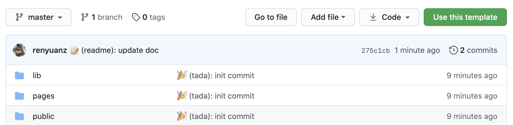

# NextJS Typescript Boilerplate

Live demo: https://nextjs-typescript-graphql-starter.vercel.app

Bootstrap a developer-friendly NextJS app configured with:

- [Typescript](https://www.typescriptlang.org/)
- [Apollo Server](https://github.com/apollographql/apollo-server) creates your GraphQL API
- [GraphQL code generator](https://graphql-code-generator.com/) automatically generates Apollo Hooks, HoC, TS types
- Linting with [ESLint](https://eslint.org/)
- Formatting with [Prettier](https://prettier.io/)
- Linting, typechecking and formatting on by default using [`husky`](https://github.com/typicode/husky) for commit hooks
- Testing with [Jest](https://jestjs.io/) and [`react-testing-library`](https://testing-library.com/docs/react-testing-library/intro)

## Deploy your own

Deploy the example using [Vercel](https://vercel.com):

[](https://vercel.com/import/project?template=https://github.com/renyuanz/nextjs-typescript-graphql-starter)

## How to use

### Use this template

Click the "green" button on the right



### Download manually

Download the example:

```bash
git clone git@github.com:renyuanz/nextjs-graphql-ts-codegen-boilerplate.git my-next-project
cd my-next-project
```

Install it and run:

```bash
npm install
npm run dev
# or
yarn
yarn dev
```

## Run tests

```bash
yarn test
# or watching
yarn test --watch
```
